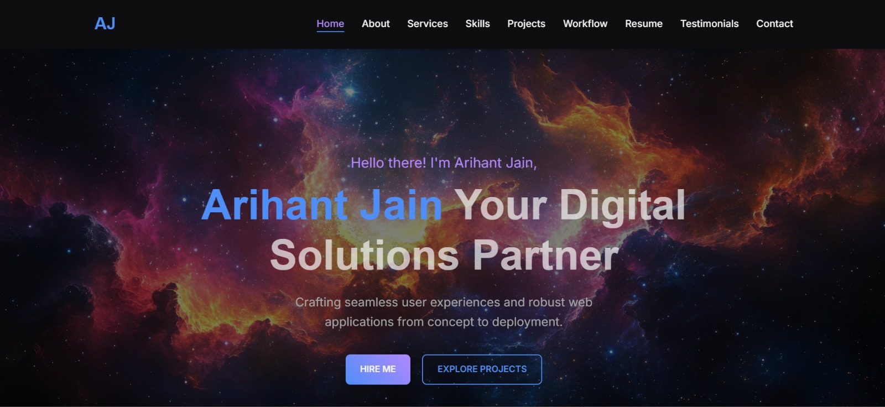

# 🌐 Personal Portfolio Website  

Welcome to the repository of my **personal portfolio website**!  
This website is crafted to serve as my **digital identity** — a central place where visitors can explore my journey, projects, and ways to connect with me.  

It’s more than just a portfolio — it’s a **showcase of creativity, design, and functionality**, built with modern technologies to ensure speed, responsiveness, and aesthetics.  

---

## ✨ Highlights  

🔹 **Responsive Design** – Perfectly adapts to desktops, tablets, and mobile devices.  
🔹 **Clean & Minimal UI** – Simple, elegant, and distraction-free design.  
🔹 **Interactive Animations** – Smooth transitions powered by Framer Motion.  
🔹 **Project Showcase** – Dedicated sections to highlight key works.  
🔹 **Contact Section** – Get in touch easily with a built-in contact form.  
🔹 **Dark/Light Mode** – User-friendly theme switching.  
🔹 **SEO Optimized** – Structured to rank well and improve visibility.  

---

## 🖼️ Screens & Demo  

### 🔥 Preview  
  
*(Replace with an actual screenshot or GIF)*  

### 🌍 Live Demo  
👉 [View the Live Portfolio](https://your-portfolio-link.com)  

---

## 🛠️ Tech Stack  

This project is powered by the **latest web technologies** for performance and modern UI/UX.  

- ⚛️ **React** – Component-based frontend framework  
- 🟦 **TypeScript** – Type-safe, maintainable code  
- 🎨 **Tailwind CSS** – Utility-first styling for rapid design  
- 🎭 **Framer Motion** – Smooth animations and transitions  
- ⚡ **Vite** – Next-generation frontend tooling for fast builds  
- 📦 **NPM** – Dependency management  

---

## 📂 Project Structure  

```bash
portfolio/
│
├── public/              # Static assets (icons, images, etc.)
├── src/
│   ├── assets/          # Images and media
│   ├── components/      # Reusable components (Navbar, Footer, etc.)
│   ├── pages/           # Pages (Home, About, Projects, Contact)
│   ├── App.tsx          # Root component
│   └── index.tsx        # Entry point
│
├── package.json         # Dependencies & scripts
├── tailwind.config.js   # Tailwind configuration
├── tsconfig.json        # TypeScript configuration
└── vite.config.ts       # Vite configuration


